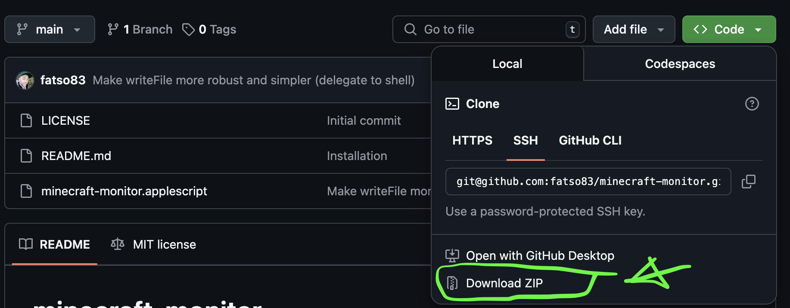

# game-time
> Monitor game time on macOS of Steam Games and Minecraft Java version

# What is it?
A script to fix Minecraft issue [(MCL-14705)](https://bugs.mojang.com/browse/MCL/issues/MCL-14705),
which is that Apple's Screen Time feature is unable to control applications that are built
using Java technology. Which also applies to Steam Games.

It basically works by asking macOS to keep tabs on the usage of any game process 
and, once we go over the daily or weekly threshold, kills the game process.

# Installation


## 1. Download the files
Most non-techies should just download the files as a zip-file and unzip it in `~/Downloads`. To unzip, just double-click the file once the download has finished. The ones that are well versed in Git can just clone the repo.

## 2. Run the install script
Now you need to navigate to the folder in the `Terminal.app`. If you have opened the Terminal app, you will typically now type the following:

```bash
cd ~/Downloads/minecraft-monitor-main
./install.sh
```

That's it!

## 3. Customise the settings
You can see the basic settings in the file `config.plist`, which you can open in any text editor. Example:
```xml
    <!-- hour:minutes -->
    <key>weeklyMax</key>
    <string>5:00</string>

    <!-- hour:minutes -->
    <key>dailyMax</key>
    <string>1:00</string>
```
Just change the values as you see fit. Once you feel you have the settings right, just re-run `./install.sh`.


# Acknowledgements

This started as a straight up copy of user "jhopgei"'s (Jürgen, last name unknown) Applescript shared on the
[Mojang bug tracker (MCL-14705)](https://bugs.mojang.com/browse/MCL/issues/MCL-14705).

Then it was modified and brought to GitHub as [minecraft-monitor](https://github.com/fatso83/minecraft-monitor). I followed this up with extending it to Steam games (or any other process pattern).
